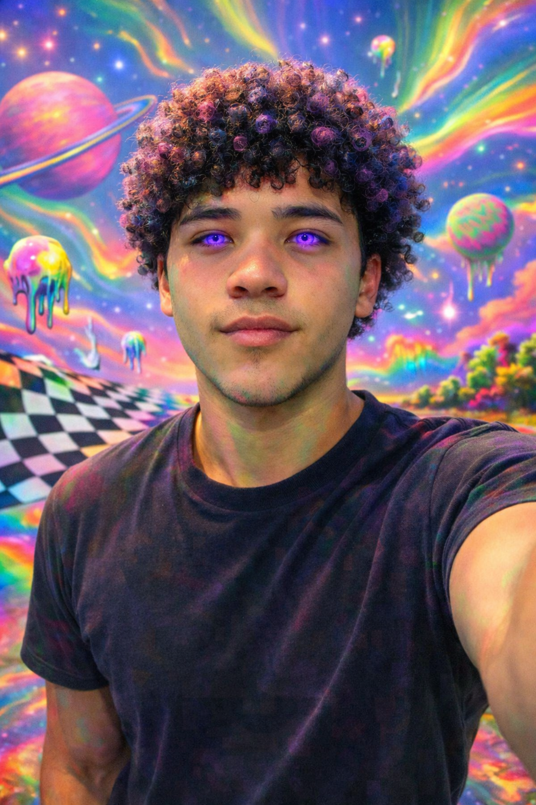
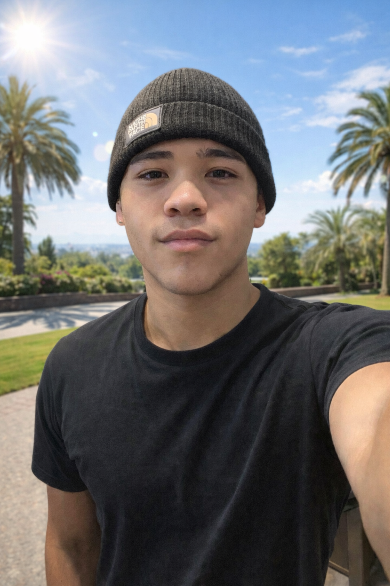

# Week 3 – Selfie & Identity

## The Artifact
Describe or embed your artifact here.
Include images, links, or media as appropriate.

### Selfie 1

### Selfie 2

## Process Notes
How did you make this?
What tools did you use?
What decisions did you make?

I made these images by using AI image generation and editing tools to transform an original selfie into two different visual representations of myself. I started with a realistic selfie and used AI to adjust the setting, appearance, and style based on specific ideas I wanted each image to express. For the sunny outdoor selfie, I focused on creating a natural but idealized version of myself by changing the background to a bright, tropical setting with sunlight and palm trees. I kept most of my physical features realistic because I wanted that image to feel grounded and recognizable.

For the second selfie, I made more dramatic creative decisions. I used AI to distort the colors, add glowing purple eyes, create curly hair, and design a surreal, psychedelic background. These choices were intentional because I wanted that image to represent creativity, imagination, and a more exaggerated inner version of myself rather than realism.

The main tools I used were AI-based image generation and photo editing prompts. My biggest decisions involved contrast—realistic versus surreal, external identity versus internal emotion. I chose visual elements like color, lighting, and background carefully to make each selfie communicate a different side of who I am. Together, the two images became a way to explore both self-perception and artistic expression.

## Reflection
Respond to this week’s reflection prompt in 200–300 words.

I look at these pictures and I see two different people. The picture with the colors and the purple eyes and the crazy background is like the me that thinks and comes up with ideas. This picture has a lot of colors and it looks really strange. That is what my mind is like sometimes. It is busy. I think about a lot of things and it isn’t always real. The purple eyes are what I notice the most because they mean being myself and being different from people. The pictures show two sides of myself. This image really says a lot about me. It shows the parts of myself that I do not always share with people. The image represents how I feel on the inside, especially when I am thinking deeply about things or when I am being creative with the image, and with my life. The image feels more expressive and emotional That is what I like about the image.

The second picture, with the sunshine and palm trees is a real and calm picture of me. This is what people see everyday. I look relaxed and confident. I look like I am a part of the real world. The second picture is simple and peaceful. This is very different from the other picture which has a crazy and colorful background.

Together these images show the difference between how I present myself outwardly and how I feel internally. Both sides are important to who I am. One shows my external personality, while the other shows my inner creativity and emotions.

## Attribution & AI Use
- DALL-E(ChatGPT)
- I uploaded two photos of myself and used the prompts “make me a selfie of myself based on the two photos given, and put a sunny background” and “now make me another selfie but distorted colors, purple eye color, trippy background, and give me curly hair fro”
- The AI generated two different selfies in two different types of styles
- I decided to change my eyes, the background, and my hair